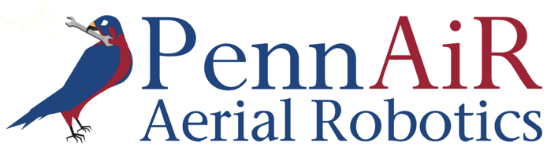

# Readme File

Answer the following questions after you have completed your coding challenge. Please be truthful in your responses. Remember we are looking for commitment and willingness to learn, not previous knowledge, so don’t get discouraged if you’re having trouble. You have done the hard work already, so be clear, yet brief in your answers.

# Questions

1. **How far did you get with the challenge? How much time did it take?**

2. **Please provide a brief description of the way that you have organized your code.**
    
    1. Be sure to also include total distance traveled and waypoint order from Task 3.

3. **Please provide instructions on how to run your code.**

4. **Is there any other relevant information that would be helpful for us to know?**
